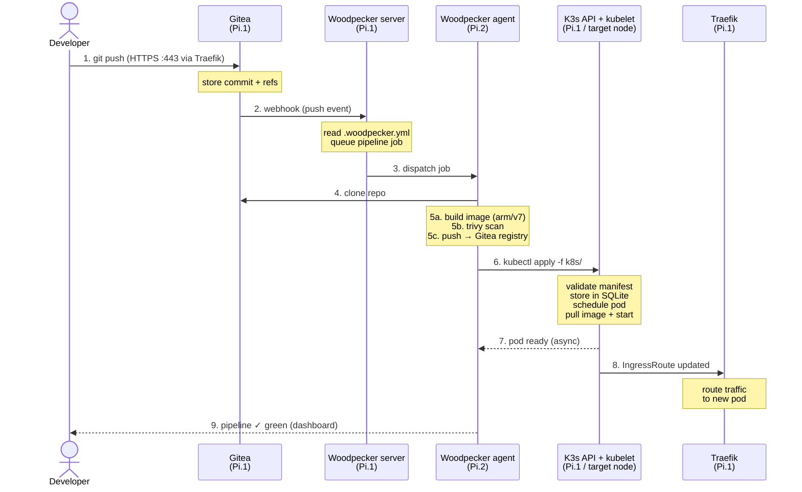
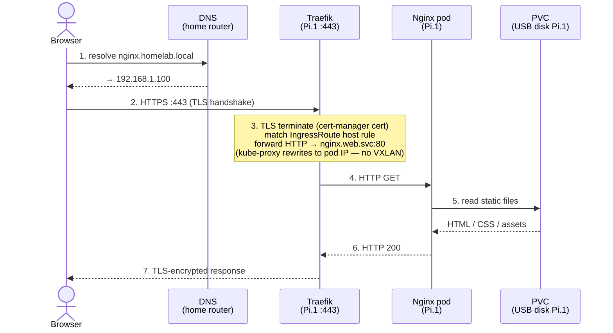
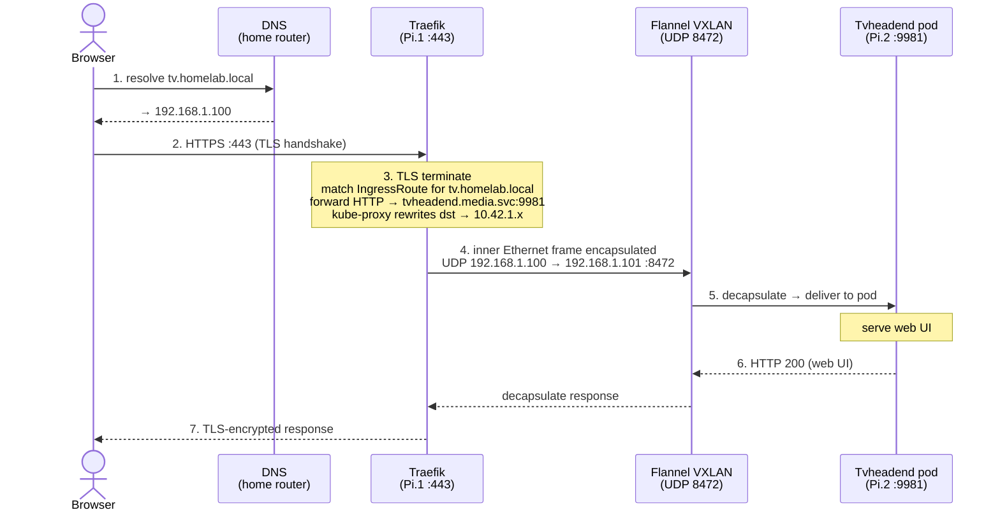
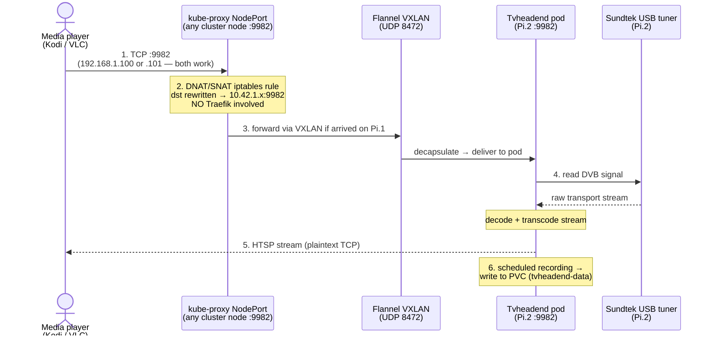
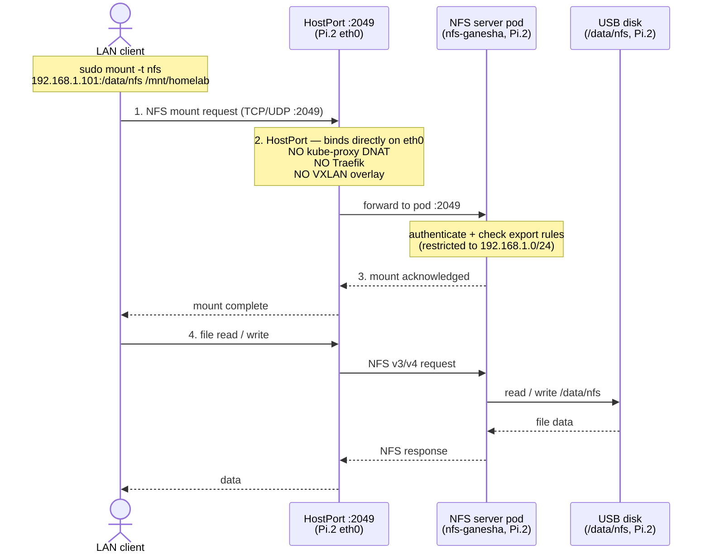

# telco-homelab — High-Level Design

| Field      | Value |
|------------|-------|
| Document   | High-Level Design — Edition 1 |
| Version    | v1.2.0-rc.7 |
| Milestone  | [v1.2.0 — HLD document & network inventory](https://github.com/hervetchoffo/telco-homelab/milestone/1) |
| Status     | In Progress |
| Author     | Herve Tchoffo |
| Repository | <https://github.com/hervetchoffo/telco-homelab> |

> This document is the canonical High-Level Design for Edition 1 (Core
> Infrastructure). It is written to be accessible to readers who are not
> Kubernetes or infrastructure experts. Every technical concept is explained
> in plain language with references for deeper reading.

---

## Table of contents

1. [Introduction](#1-introduction)
2. [Acronyms](#2-acronyms)
3. [Main use cases](#3-main-use-cases)
4. [Key components](#4-key-components)
5. [Architecture decisions (ADRs)](#5-architecture-decisions-adrs)
6. [Hardware inventory](#6-hardware-inventory)
   - 6.1 [Node inventory](#61-node-inventory)
   - 6.2 [Peripheral inventory](#62-peripheral-inventory)
   - 6.3 [RAM budget analysis](#63-ram-budget-analysis)
7. [Kubernetes architecture primer](#7-kubernetes-architecture-primer)
   - 7.1 [Control plane](#71-control-plane)
   - 7.2 [Worker node](#72-worker-node)
   - 7.3 [How K3s adapts Kubernetes for constrained hardware](#73-how-k3s-adapts-kubernetes-for-constrained-hardware)
   - 7.4 [Kubernetes workload resource types](#74-kubernetes-workload-resource-types)
8. [Network architecture](#8-network-architecture)
   - 8.1 [Architecture diagram](#81-architecture-diagram)
   - 8.2 [Network planes](#82-network-planes)
   - 8.3 [How Flannel VXLAN works](#83-how-flannel-vxlan-works)
   - 8.4 [Ingress — Traefik and cert-manager](#84-ingress--traefik-and-cert-manager)
   - 8.5 [HostPort vs NodePort — explanation and choices](#85-hostport-vs-nodeport--explanation-and-choices)
   - 8.6 [Service exposure summary](#86-service-exposure-summary)
9. [Node layout & service placement](#9-node-layout--service-placement)
   - 9.1 [Placement strategy & node labels](#91-placement-strategy--node-labels)
   - 9.2 [Pi #1 — server node workloads](#92-pi-1--server-node-workloads)
   - 9.3 [Pi #2 — agent node workloads](#93-pi-2--agent-node-workloads)
10. [Functional call flows](#10-functional-call-flows)
    - 10.1 [UC-1 — Developer pushes code or manifests](#101-uc-1--developer-pushes-code-or-manifests)
    - 10.2 [UC-2 — User accesses the web server (Nginx)](#102-uc-2--user-accesses-the-web-server-nginx)
    - 10.3 [UC-3a — User accesses Tvheadend web UI (HTTPS)](#103-uc-3a--user-accesses-tvheadend-web-ui-https)
    - 10.4 [UC-3b — User streams TV (HTSP)](#104-uc-3b--user-streams-tv-htsp)
    - 10.5 [UC-4 — User mounts the NFS share](#105-uc-4--user-mounts-the-nfs-share)
11. [Test & validation of call flows](#11-test--validation-of-call-flows)
    - 11.1 [Validation strategy and tooling](#111-validation-strategy-and-tooling)
    - 11.2 [UC-1 — CI/CD pipeline validation](#112-uc-1--cicd-pipeline-validation)
    - 11.3 [UC-2 — Nginx web server validation](#113-uc-2--nginx-web-server-validation)
    - 11.4 [UC-3a — Tvheadend web UI validation](#114-uc-3a--tvheadend-web-ui-validation)
    - 11.5 [UC-3b — HTSP streaming validation](#115-uc-3b--htsp-streaming-validation)
    - 11.6 [UC-4 — NFS mount validation](#116-uc-4--nfs-mount-validation)
    - 11.7 [Network-level validation with packet capture](#117-network-level-validation-with-packet-capture)
    - 11.8 [Architecture impact of validation tooling](#118-architecture-impact-of-validation-tooling)
12. [Storage design](#12-storage-design)
    - 12.1 [Storage architecture](#121-storage-architecture)
    - 12.2 [PVC capacity enforcement — XFS project quotas](#122-pvc-capacity-enforcement--xfs-project-quotas)
    - 12.3 [PVC inventory](#123-pvc-inventory)
    - 12.4 [USB disk layout and cross-node backup](#124-usb-disk-layout-and-cross-node-backup)
13. [Repository & IaC structure](#13-repository--iac-structure)
    - 13.1 [Directory layout](#131-directory-layout)
    - 13.2 [Versioning strategy (SemVer)](#132-versioning-strategy-semver)
    - 13.3 [CI/CD trigger strategy](#133-cicd-trigger-strategy)
14. [Edition 1 roadmap](#14-edition-1-roadmap)
15. [Security considerations](#15-security-considerations)
16. [Open issues & risks](#16-open-issues--risks)
17. [References](#17-references)
18. [Revision history](#18-revision-history)

---

## 1. Introduction

**telco-homelab** is a two-node Kubernetes cluster deployed on Raspberry Pi 2B
hardware at home. It hosts four network services — a web server, a Git server,
a TV streaming server, and a shared file system — and manages them entirely as
**Infrastructure as Code (IaC)**: every service is described in YAML files that
are version-controlled in Git, just like application source code.

The project follows the *Telco Cloud Beginner* training path:

```
Linux  →  Docker  →  Kubernetes  →  CI/CD
```

### Scope

- **Edition 1 — Core Infrastructure:** single server + single agent topology.
- **Services:** Tvheadend, NFS, Nginx, Gitea, Woodpecker CI.
- **Storage:** local-path PVCs backed by USB disks with XFS quota enforcement.
- **Ingress:** Traefik (K3s built-in) with TLS via cert-manager.
- **HA:** out of scope for Edition 1 — requires ≥ 3 nodes for Raft quorum
  ([Risk R1](#16-open-issues--risks)).

---

## 2. Acronyms

| Acronym | Full form | Brief meaning |
|---------|-----------|---------------|
| ADR | Architecture Decision Record | A short document capturing an important design choice |
| CI/CD | Continuous Integration / Continuous Delivery | Automated pipeline from code commit to deployment |
| CRI | Container Runtime Interface | The standard API between kubelet and a container runtime (e.g. containerd); `crictl` speaks this interface |
| CIDR | Classless Inter-Domain Routing | A compact notation for IP address ranges, e.g. `10.42.0.0/16` |
| CRD | Custom Resource Definition | A Kubernetes extension that adds new object types beyond the built-in ones |
| CVE | Common Vulnerabilities and Exposures | A public catalogue of known software security flaws |
| DVB | Digital Video Broadcasting | The standard for digital TV transmission (DVB-T terrestrial, DVB-S satellite, etc.) |
| EPG | Electronic Programme Guide | The on-screen TV schedule provided by broadcasters |
| HA | High Availability | A design where the system keeps running even if one component fails |
| HTSP | Home TV Streaming Protocol | Tvheadend's native binary protocol for streaming live TV and EPG data |
| IaC | Infrastructure as Code | Describing infrastructure in files (YAML) instead of clicking through a UI |
| IP | Internet Protocol | The addressing scheme used to route packets across networks |
| LAN | Local Area Network | The private network inside a home or office |
| NFS | Network File System | A protocol that allows a remote disk to be mounted as if it were local |
| PVC | PersistentVolumeClaim | A Kubernetes request for durable storage that survives pod restarts |
| RFC | Request for Comments | An IETF standards document (e.g. RFC 7348 defines VXLAN) |
| SPOF | Single Point of Failure | A component whose failure brings down the whole system |
| TLS | Transport Layer Security | The cryptographic protocol that secures HTTPS connections |
| VXLAN | Virtual eXtensible LAN | A tunnelling protocol that encapsulates Layer 2 Ethernet frames in UDP packets |
| VNI | VXLAN Network Identifier | A 24-bit segment ID within a VXLAN overlay (analogous to a VLAN tag) |
| VTEP | Virtual Tunnel End Point | The process on each node that encapsulates/decapsulates VXLAN packets |

---

## 3. Main use cases

The platform is built around four primary use cases, each detailed as a
step-by-step call flow in [section 10](#10-functional-call-flows).

### UC-1 — Developer pushes code or Kubernetes manifests

A developer commits YAML manifests or application source code and pushes to
**Gitea**. **Woodpecker CI** automatically picks up the change, builds any new
container image, scans it for vulnerabilities, and applies the updated manifests
to the cluster. The developer never manually touches the cluster.

> **Why this matters:** this is the GitOps pattern — the Git repository is the
> single source of truth. Any infrastructure change must go through a pull
> request and be recorded in Git history.

### UC-2 — User accesses the web server (Nginx)

Any device on the LAN navigates to `https://nginx.homelab.local`. **Traefik**
receives the request on Pi #1, terminates TLS, routes to the **Nginx** pod, and
returns the static web page.

### UC-3 — User streams TV (Tvheadend)

Two independent sub-cases share the same Tvheadend pod and Sundtek USB tuner:

- **UC-3a (HTTPS web UI):** browser navigates to `https://tv.homelab.local` —
  Traefik proxies the request to Tvheadend on Pi #2 over the VXLAN overlay.
- **UC-3b (HTSP streaming):** a media player (Kodi, VLC) connects to port 9982
  on any cluster node IP (`192.168.1.100` or `192.168.1.101`) — K3s NodePort
  forwards the TCP connection directly to Tvheadend on Pi #2 via DNAT/SNAT,
  bypassing Traefik entirely.

### UC-4 — User mounts the NFS share

A Linux or macOS machine on the LAN mounts the share exported by the **NFS
server** on Pi #2. The mount point is `192.168.1.101:/data/nfs`. NFS traffic
travels directly on the LAN via HostPort 2049 — no Traefik, no VXLAN.

> **Why NFS has no DNS entry:** NFS is not an HTTP service, so there is nothing
> for Traefik to route. Clients use the server IP directly. A `*.homelab.local`
> DNS record would be misleading and unused.

---

## 4. Key components

### K3s

[K3s](https://k3s.io) is the Kubernetes distribution chosen for this project
([ADR-001](#5-architecture-decisions-adrs)). It packages the entire Kubernetes
control plane as a single binary under 100 MB, replaces `etcd` with **SQLite**
(saving ~300 MB RAM), and ships with Traefik and a storage provisioner included.
Maintained by SUSE/Rancher; CNCF Sandbox project.

### Traefik

[Traefik](https://traefik.io) is the ingress controller — the traffic cop for
all HTTP/S requests entering the cluster. It is bundled with K3s. When a new
`IngressRoute` CRD object is created, Traefik automatically picks it up and
starts routing.

### Flannel

[Flannel](https://github.com/flannel-io/flannel) is the overlay network plugin
bundled with K3s. It creates a virtual pod network (`10.42.0.0/16`) spanning
all nodes so pods on different physical machines communicate as if on the same
LAN. K3s uses Flannel's **VXLAN** mode by default
(see [section 8.3](#83-how-flannel-vxlan-works)).

> **Pod network vs service network:** Flannel only manages the *pod* network
> (`10.42.0.0/16`). The *service* network (`10.43.0.0/16`) is a separate
> virtual address space managed entirely by `kube-proxy` using Linux `iptables`
> rules — no tunnelling involved. When a pod sends a request to a ClusterIP
> (e.g. `10.43.0.15`), `kube-proxy`'s iptables rules rewrite the destination
> to a real pod IP (e.g. `10.42.1.7`) before Flannel ever sees the packet.

### Gitea

[Gitea](https://about.gitea.com) is the self-hosted Git server
([ADR-002](#5-architecture-decisions-adrs)). It provides Git hosting, pull
requests, issues, and a container registry — all in ~80 MB RAM at idle. GitLab
was excluded: its minimum footprint is 2–4 GB.

### Woodpecker CI — server and agent

[Woodpecker CI](https://woodpecker-ci.org) runs as two separate components:

- **Server (Pi #1):** the orchestrator. It receives webhooks from Gitea,
  reads the `.woodpecker.yml` pipeline definition, queues jobs, and stores
  pipeline results in SQLite. It exposes the web dashboard at
  `ci.homelab.local`.
- **Agent (Pi #2):** the executor. It polls the server for queued jobs, checks
  out the source code, runs each pipeline step inside a container (build, scan,
  push, deploy), and reports the result back to the server. The agent does the
  heavy lifting — Docker image builds, Trivy scans, and `kubectl apply` calls
  all happen on the agent.

The separation allows the orchestration state to remain on the stable server
node (Pi #1) while CPU-intensive build work is offloaded to the agent (Pi #2),
avoiding RAM pressure on the control plane.

### Tvheadend

[Tvheadend](https://tvheadend.org) is a TV streaming and recording server. It
reads the DVB signal from the Sundtek USB tuner, builds an EPG, and streams
channels to HTSP/HLS clients. Recordings are written to a PVC on the Pi #2
USB disk.

### NFS server (nfs-ganesha)

[nfs-ganesha](https://github.com/nfs-ganesha/nfs-ganesha) is a **user-space**
NFS v3/v4 server. "User-space" means it runs entirely as a normal process
inside a container — it does not require the Linux kernel's built-in NFS server
modules (`nfsd`, `rpc.mountd`, etc.) to be loaded. This matters because
Raspberry Pi OS Lite uses a minimal kernel configuration where loading extra
kernel modules is non-trivial and can break between OS updates. By running
nfs-ganesha in a container, we get a reproducible, updatable NFS server with
no kernel dependency.

### Nginx

[Nginx](https://nginx.org) serves static web content from a PVC. It is the
simplest workload — a single pod with HTML/CSS/asset files, exposed via Traefik.

### cert-manager

[cert-manager](https://cert-manager.io) is a Kubernetes-native tool that
automates the issuance and renewal of TLS certificates. It watches
`Certificate` CRD objects and requests new certificates from the configured
issuer (in our case a local self-signed CA) before they expire. Without
cert-manager, certificates would need to be renewed and injected manually.
Clients on the LAN must import the local CA certificate once to avoid browser
warnings.

---

## 5. Architecture decisions (ADRs)

All major design choices are stored in `docs/adr/`.

| ADR | Topic | Decision | Key rationale |
|-----|-------|----------|---------------|
| [ADR-001](../adr/ADR-001-k3s-vs-k0s.md) | K8s distribution | K3s with SQLite | 1 GB RAM per node; etcd needs ~300 MB per replica and ≥ 3 nodes |
| [ADR-002](../adr/ADR-002-gitea-vs-gitlab.md) | Git server | Gitea (~80 MB RAM) | GitLab requires 2–4 GB |
| [ADR-003](../adr/ADR-003-bookworm-vs-trixie.md) | Operating system | RPi OS Lite Trixie (Debian 13, kernel 6.6 LTS) | 32-bit armv7l; official RPi Foundation support |
| [ADR-004](../adr/ADR-004-woodpecker-vs-others.md) | CI runner | Woodpecker CI (~50 MB) | Native Gitea OAuth; arm/v7 image; pipeline-as-code |
| [ADR-005](../adr/ADR-005-traefik-ingress.md) | Ingress controller | Traefik (K3s built-in) | Zero extra RAM; CRD routing; auto-deployed |
| [ADR-006](../adr/ADR-006-local-path-storage.md) | Storage | local-path-provisioner + XFS quotas | No distributed storage overhead; Ceph/Longhorn excluded |
| [ADR-007](../adr/ADR-007-no-ha-edition1.md) | HA topology | 1 server + 1 agent (no HA) | HA needs ≥ 3 nodes; Edition 1 accepts SPOF |

---

## 6. Hardware inventory

### 6.1 Node inventory

| Node | IP address | K3s role | CPU | RAM | Storage |
|------|-----------|---------|-----|-----|---------|
| Pi #1 | `192.168.1.100` | Server (control-plane + worker) | ARM Cortex-A7 @ 900 MHz (4-core) | 1 GB LPDDR2 | 1 TB USB + microSD (OS) |
| Pi #2 | `192.168.1.101` | Agent (worker) | ARM Cortex-A7 @ 900 MHz (4-core) | 1 GB LPDDR2 | 1 TB USB + microSD (OS) |

### 6.2 Peripheral inventory

| Device | Qty | Attached to | Purpose |
|--------|-----|-------------|---------|
| Sundtek MediaTV USB tuner | 1 | Pi #2 | DVB signal input — USB passthrough to Tvheadend pod |
| 1 TB USB disk | 2 (one per node) | Pi #1 & Pi #2 | PVCs + cross-node rsync backup |

### 6.3 RAM budget analysis

The table below shows the estimated steady-state RAM envelope per node.

> **A note on measurement basis:** figures in the *Basis* column are
> categorised as follows:
>
> - **K3s docs** — taken from the official K3s hardware requirements
>   page [[2]](#17-references), which lists measured values for server and
>   agent processes on minimal ARM hardware.
> - **Measured (community)** — drawn from published `free -m` or `ps_mem`
>   measurements on armv7l hardware running the same software, referenced
>   individually below [[1,3,4]](#17-references).
> - **Vendor docs** — the component's own documentation states an expected
>   idle footprint [[5,6]](#17-references).
> - **Estimated** — no direct armv7l measurement was found. The figure is a
>   conservative estimate from the component's architecture and general Linux
>   process overhead. It should be treated as a lower bound and **verified
>   once the cluster is running** with `kubectl top pods`.

| Component | Pi #1 (MB) | Pi #2 (MB) | Basis |
|-----------|-----------|-----------|-------|
| RPi OS Lite (kernel + userspace) | ~120 | ~120 | Measured (community) [[1]](#17-references) |
| K3s server (API server, scheduler, controller, SQLite) | ~230 | — | K3s docs [[2]](#17-references) |
| K3s agent (kubelet + kube-proxy + containerd — see note) | ~125 | ~125 | K3s docs [[2]](#17-references) |
| Traefik ingress | ~45 | — | Measured (community) [[3]](#17-references) |
| CoreDNS | ~20 | ~20 | Measured (community) [[4]](#17-references) |
| Nginx | ~25 | — | Estimated — nginx:alpine is a minimal ~5 MB image; idle process RSS on armv7l is ~20–30 MB |
| Gitea | ~80 | — | Vendor docs [[5]](#17-references) |
| Woodpecker CI server | ~50 | — | Vendor docs [[6]](#17-references) |
| NFS server (nfs-ganesha) | — | ~40 | Estimated — nfs-ganesha is a single user-space daemon; idle RSS on armv7l is typically 30–50 MB |
| Tvheadend | — | ~90 | Measured; rises to ~200 MB during active transcoding [[7]](#17-references) |
| Woodpecker CI agent | — | ~45 | Estimated — idle agent is a small Go binary; spikes to ~300 MB during Docker builds |
| **Total (steady-state)** | **~695 MB** | **~440 MB** | Headroom: ~305 MB / ~560 MB |

> **Why containerd is not listed as a separate row:**
> K3s embeds containerd directly — it is not an independent process. When K3s
> starts the agent, it spawns its own bundled containerd instance as part of
> the same process group. The ~125 MB agent figure therefore already includes
> kubelet, kube-proxy, and containerd combined, matching the K3s documentation
> which measures them together. Listing containerd separately would
> double-count approximately 55 MB per node.

> **How optimistic are these figures?** All values are *idle* measurements.
> Under load: Tvheadend reaches ~200 MB during active transcoding; the
> Woodpecker agent spikes to ~300 MB during Docker builds. The Linux page cache
> will also absorb any free RAM (normal and beneficial, but looks alarming in
> `free -m`).
>
> **Recommended mitigations:**
> 1. Enable **zram swap** (512 MB) on both nodes via `scripts/setup-zram.sh`.
> 2. Set `resources.requests` and `resources.limits` on every pod — especially
>    the Woodpecker agent (e.g. `memory: 512Mi` limit).
> 3. **Stagger heavy workloads** — schedule CI builds outside peak streaming
>    hours using Woodpecker's cron pipeline trigger.
> 4. Monitor continuously with `kubectl top nodes` and `kubectl top pods`.
> 5. If Tvheadend causes RAM pressure, disable software transcoding and let
>    the client decode the raw stream.

---

## 7. Kubernetes architecture primer

> This section is for readers new to Kubernetes. Experts can skip to
> [section 8](#8-network-architecture).

Kubernetes manages containerised applications across a cluster of machines. A
cluster has two kinds of machines:

- **Control plane** — the "brain." Stores the cluster state and makes all
  scheduling decisions. Runs on Pi #1.
- **Worker nodes** — the "hands." Run the application containers. Pi #2 is
  the dedicated worker. Pi #1 *also* acts as a worker for its own services
  (Nginx, Gitea, Woodpecker server) because K3s runs both roles on the server
  node by default — meaning Pi #1 has *both* the K3s server process (control
  plane) and the K3s agent process (kubelet + containerd) active simultaneously.

### 7.1 Control plane

| Component | Role | Analogy |
|-----------|------|---------|
| `kube-apiserver` | Single REST entry point — all `kubectl` commands go through it | The "front desk" |
| SQLite (replaces `etcd`) | Stores the entire cluster state (desired and actual) | The cluster's "memory" |
| `kube-scheduler` | Decides which worker node a new pod runs on | The "placement agent" |
| `kube-controller-manager` | Watches desired state; corrects drift (restarts crashed pods, etc.) | The "supervisor" |

### 7.2 Worker node

| Component | Role | Analogy |
|-----------|------|---------|
| `kubelet` | Receives pod specs from the API server; tells containerd to start/stop containers | The "local foreman" |
| `kube-proxy` | Programs Linux `iptables` rules to route Kubernetes Service traffic | The "internal router" |
| `containerd` | Pulls images and runs containers (embedded inside the K3s agent process) | The "container engine" |
| Pods | The smallest deployable unit — one or more containers sharing network and storage | The "applications" |

### 7.3 How K3s adapts Kubernetes for constrained hardware

K3s makes the following changes to the standard Kubernetes distribution:

- **Single binary** — all control plane components are packaged into a single
  executable (`/usr/local/bin/k3s`). This simplifies installation, reduces disk
  footprint, and lowers startup overhead.
- **SQLite instead of etcd** — replaces the heavy distributed database etcd
  with SQLite. This significantly reduces RAM usage (~300 MB savings) and is
  acceptable because Edition 1 does not require high availability (distributed
  quorum requires more than 2 nodes anyway).
- **Traefik bundled** — the ingress controller is included by default and
  automatically deployed on first boot, eliminating the need for additional
  installations.
- **local-path-provisioner bundled** — provides simple, dynamic persistent
  storage by creating directories on the local filesystem (USB disks in our
  case). This avoids the high resource cost of distributed storage solutions
  like Longhorn or Ceph.
- **containerd instead of Docker** — K3s manages containers directly via its
  embedded containerd instance. Docker Engine and the `docker` CLI are **not**
  installed on the cluster nodes. This saves ~50 MB and removes a large
  dependency.

  For day-to-day container inspection and troubleshooting, the following tools
  replace `docker` commands:

  | Tool | Example usage | Purpose |
  |------|--------------|---------|
  | `k3s crictl ps` | `sudo k3s crictl ps` | List running containers. K3s-bundled variant; uses the correct socket automatically without extra config. Preferred for K3s clusters. |
  | `crictl` | `sudo crictl images` | CRI-compatible CLI; supports `ps`, `images`, `logs`, `exec`, `inspect`. Equivalent to most `docker` subcommands for read-only inspection. Must point to the K3s socket: `--runtime-endpoint unix:///run/k3s/containerd/containerd.sock` |
  | `ctr` | `sudo ctr -n k8s.io images ls` | Low-level containerd CLI. Useful for direct image management (`pull`, `rm`). Requires the `-n k8s.io` namespace flag to see K3s-managed objects. |
  | `kubectl` | `kubectl logs`, `kubectl exec` | Preferred for all pod-level interaction — works at the Kubernetes layer and does not require SSH access to the node. |

  > `docker` commands will silently fail or connect to a non-existent socket on
  > this cluster. Always use `k3s crictl` or `kubectl` instead. [[15]](#17-references)

### 7.4 Kubernetes workload resource types

Kubernetes provides several resource types for running workloads. Understanding
the differences explains the choices made in sections
[9.2](#92-pi-1--server-node-workloads) and [9.3](#93-pi-2--agent-node-workloads).

| Resource type | What it does | Typical use |
|---------------|-------------|-------------|
| `Deployment` | Runs N identical, stateless replicas; replaces failed pods automatically; supports rolling updates | Stateless services: Nginx, Woodpecker server/agent |
| `StatefulSet` | Like a Deployment but each pod gets a stable hostname and a dedicated PVC that follows it | Stateful services with persistent data: Gitea, Tvheadend |
| `DaemonSet` | Runs exactly one pod per node (or per matching node); ignores replica count | Node-level services: Traefik ingress, NFS server |
| `Job` | Runs a pod to completion once; retries on failure | One-shot tasks: database migration, certificate generation |
| `CronJob` | Runs a Job on a schedule | Periodic tasks: rsync backup, log rotation |

**Key differences between `Deployment` and `StatefulSet`:**

A `Deployment` treats all its pods as interchangeable — they share no stable
identity, and any pod can be killed and replaced with a fresh one on any node.
This is ideal for stateless services.

A `StatefulSet` gives each pod a stable, predictable name (e.g. `gitea-0`,
`tvheadend-0`) and its *own* PVC that is not shared with other pods and is
*not* deleted when the pod restarts. This is essential for Gitea and Tvheadend.

**Choices in this project:**

| Workload | Type | Reason |
|----------|------|--------|
| Nginx | `Deployment` | Stateless — reads from PVC but holds no session state |
| Gitea | `StatefulSet` | SQLite database + git repos must persist with a stable pod identity |
| Woodpecker server | `Deployment` | SQLite state on PVC is sufficient; pod identity not required |
| Woodpecker agent | `Deployment` | Stateless executor; PVC not needed |
| Traefik | `DaemonSet` | Must run on every ingress node (Pi #1 only, via nodeSelector) |
| NFS server | `DaemonSet` | Must run on exactly Pi #2; one instance per storage node |
| Tvheadend | `StatefulSet` | USB tuner access + recording PVC must stay on Pi #2 with a stable pod name |
| rsync backup | `CronJob` | Scheduled nightly task — no persistent identity needed |

---

## 8. Network architecture

### 8.1 Architecture diagram

```
┌───────────────────────────────────────────────────────────────────────────┐
│                      Home LAN — 192.168.1.0/24                            │
│                                                                           │
│           ┌─────────────────────────────────────┐                         │
│           │    Router / Gateway — 192.168.1.1   │                         │
│           └──────────┬───────────────┬──────────┘                         │
│                      │               │                                    │
│   ┌──────────────────▼────┐   ┌──────▼───────────────────────┐            │
│   │  Pi #1 — K3s server   │   │  Pi #2 — K3s agent           │            │
│   │  192.168.1.100        │◄► │  192.168.1.101               │            │
│   │                       │   │                              │            │
│   │  [kube-system]        │   │  [kube-system]               │            │
│   │  ├─ K3s server+SQLite │   │  └─ K3s agent                │            │
│   │  ├─ Traefik :80/:443  │   │                              │            │
│   │  └─ CoreDNS           │   │  [storage]                   │            │
│   │                       │   │  └─ NFS server :2049         │            │
│   │  [web]                │   │                              │            │
│   │  └─ Nginx             │   │  [media]                     │            │
│   │                       │   │  └─ Tvheadend :9981/:9982    │            │
│   │  [gitea]              │   │     └─ Sundtek USB tuner     │            │
│   │  └─ Gitea :3000       │   │                              │            │
│   │                       │   │  [ci]                        │            │
│   │  [ci]                 │   │  └─ Woodpecker agent         │            │
│   │  └─ Woodpecker :8000  │   │                              │            │
│   │                       │   │  USB disk 1 TB /mnt/usb0     │            │
│   │  USB disk 1 TB        │   │  ├─ k3s-storage/ (PVCs)      │            │
│   │  /mnt/usb0 (PVCs)     │   │  ├─ /data/nfs (NFS export)   │            │
│   └───────────────────────┘   │  └─ /backup/ (rsync from Pi#1)            │
│                               └──────────────────────────────┘            │
│   ═══════════════════════════════════════════════════════════════         │
│   Flannel VXLAN overlay — pod CIDR 10.42.0.0/16 — UDP 8472                │
│   Service CIDR 10.43.0.0/16                                               │
│   ═══════════════════════════════════════════════════════════════         │
│                                                                           │
│   NFS clients: any host on 192.168.1.0/24                                 │
│   DVB antenna ──RF──► Sundtek ──USB──► Tvheadend ──HTSP──► LAN clients    │
└───────────────────────────────────────────────────────────────────────────┘
```

### 8.2 Network planes

There are three distinct network planes:

| Layer | Network / CIDR | Managed by | Purpose |
|-------|--------------|-----------|---------|
| Home LAN | `192.168.1.0/24` | Home router | Physical node communication; LAN client access |
| Pod network | `10.42.0.0/16` | Flannel VXLAN | Pod-to-pod communication across nodes |
| Service network | `10.43.0.0/16` | kube-proxy (iptables) | Stable virtual IPs for Kubernetes Services |

**Subnet allocation:**

- Pi #1 pod subnet: `10.42.0.0/24`
- Pi #2 pod subnet: `10.42.1.0/24`
- VXLAN tunnel: UDP port `8472` between `192.168.1.100` ↔ `192.168.1.101`
- CoreDNS ClusterIP: `10.43.0.10`

### 8.3 How Flannel VXLAN works

**The problem Flannel solves:** pods on Pi #1 have IPs in `10.42.0.x` and pods
on Pi #2 have IPs in `10.42.1.x`. The home router has no idea these addresses
exist. Flannel solves this by encapsulating pod traffic inside UDP packets the
LAN can route natively.

**What VXLAN actually encapsulates:** VXLAN operates at Layer 2 — it wraps
complete **Ethernet frames** (MAC header + IP header + payload) inside UDP
datagrams. This means the overlay behaves like a virtual Ethernet segment
stretched across the LAN. From the pod's perspective, it is sending normal
Ethernet frames; Flannel's VTEP converts them into UDP packets for transport
across the physical network.

```
Pod A (10.42.0.15) on Pi #1
    │
    │  Original Layer 2 Ethernet frame:
    │    Ethernet header  (src MAC → dst MAC)
    │    IP header        (src 10.42.0.15 → dst 10.42.1.25)
    │    Payload
    ▼
Flannel VTEP on Pi #1
    │  Looks up: "10.42.1.x lives on 192.168.1.101 (Pi #2)"
    │  Encapsulates the entire Ethernet frame:
    │
    │  ┌──────────────────────────────────────────────────────────────┐
    │  │  Outer UDP:  src=192.168.1.100  dst=192.168.1.101  port=8472 │
    │  │  VXLAN header: VNI=1                                         │
    │  │  ┌──────────────────────────────────────────────────────┐    │
    │  │  │  Inner Ethernet frame (src MAC → dst MAC)            │    │
    │  │  │  Inner IP: src=10.42.0.15  dst=10.42.1.25            │    │
    │  │  │  Payload                                             │    │
    │  │  └──────────────────────────────────────────────────────┘    │
    │  └──────────────────────────────────────────────────────────────┘
    ▼
Home LAN (802.3 Ethernet) — travels as a normal UDP/IP packet
    ▼
Flannel VTEP on Pi #2
    │  Strips outer UDP + VXLAN header
    │  Recovers the original inner Ethernet frame
    ▼
Pod B (10.42.1.25) — receives the original frame, unaware of the tunnel
```

**Key concepts:**

- **VTEP:** the Flannel process on each node performing encapsulation and
  decapsulation.
- **VNI:** a 24-bit segment ID (like a VLAN tag). K3s uses VNI 1 by default.
- **Standard:** VXLAN is defined in [RFC 7348](https://www.rfc-editor.org/rfc/rfc7348)
  (IETF, 2014). [[8]](#17-references)

**Security:** plain VXLAN carries no encryption — inter-node traffic is
plaintext on the LAN. Acceptable for a trusted home network. To add encryption,
use `--flannel-backend=wireguard-native` (K3s supports this natively, adds
~10 MB RAM). [[9]](#17-references)

### 8.4 Ingress — Traefik and cert-manager

Traefik is deployed as a DaemonSet on Pi #1 and exposes ports `80` and `443`
on the host IP (`192.168.1.100`). It automatically discovers `IngressRoute` CRD
objects and routes incoming HTTPS requests to the correct backend service. HTTP
(port 80) redirects to HTTPS (port 443) for all services.

DNS entries for `*.homelab.local` must point to `192.168.1.100` (Traefik on
Pi #1). Add these to the home router or a local `dnsmasq` instance.

**Traefik IngressRoute rules** — each row below corresponds to one
`IngressRoute` CRD object deployed in the cluster. Traefik evaluates these
rules on every incoming request and forwards traffic to the matching backend.

| FQDN | Protocol | Backend pod | Backend node |
|------|----------|-------------|--------------|
| `nginx.homelab.local` | HTTPS 443 | `nginx:80` | Pi #1 |
| `git.homelab.local` | HTTPS 443 | `gitea:3000` | Pi #1 |
| `ci.homelab.local` | HTTPS 443 | `woodpecker:8000` | Pi #1 |
| `tv.homelab.local` | HTTPS 443 | `tvheadend:9981` | Pi #2 (via VXLAN) |

**cert-manager** automates TLS certificate issuance and renewal. It watches
`Certificate` objects and requests new certificates from the configured issuer
(a local self-signed CA) before they expire. Clients must import the local CA
certificate once to avoid browser warnings. [[13]](#17-references)

### 8.5 HostPort vs NodePort — explanation and choices

Both mechanisms expose a pod's port on the node's network interface, but they
work differently.

**HostPort** is declared inside the pod spec itself
(`containerPort.hostPort`). Kubernetes binds the specified port directly on the
physical network interface (`eth0`) of the node the pod runs on — and *only*
that node. No cluster-wide virtual IP is created. No `kube-proxy` involvement.
If the pod moves to another node, the binding moves with it.

```yaml
containers:
- name: nfs-server
  ports:
  - containerPort: 2049
    hostPort: 2049      # binds directly on the node's eth0
```

**NodePort** is declared on a Kubernetes `Service` object. `kube-proxy`
programs DNAT and SNAT `iptables` rules on *every cluster node*, so traffic
arriving on the NodePort on *any* node is forwarded to the matching pod —
wherever it runs. When the target pod is on a different node, the connection
is forwarded via the VXLAN overlay.

```yaml
kind: Service
spec:
  type: NodePort
  ports:
  - port: 9982
    targetPort: 9982
    nodePort: 9982      # kube-proxy manages iptables rules on all nodes
```

> **NodePort (9982) is reachable via DNAT/SNAT and VXLAN encapsulation on any
> cluster node (Pi #1 or Pi #2).** A media player can address either
> `192.168.1.100:9982` or `192.168.1.101:9982` — `kube-proxy` will DNAT the
> connection to the Tvheadend pod on Pi #2 regardless of which node received
> it. If the request arrived on Pi #1, the packet is SNAT'd and forwarded to
> Pi #2 via the VXLAN tunnel before being delivered to the pod.

**Why NFS uses HostPort:**
NFS is a stateful, connection-oriented protocol that expects a fixed IP and
port. It must always reach `192.168.1.101:2049` — the node where the USB disk
is physically attached. HostPort makes this binding explicit, avoids kube-proxy
DNAT that could interfere with NFS connection tracking, and adds no extra
network hop.

**Why Tvheadend HTSP uses NodePort:**
HTSP clients can address any cluster node IP; kube-proxy forwards them to the
pod regardless of which node received the connection. NodePort also keeps the
port declaration in the Service manifest rather than buried in the pod spec —
better for IaC maintainability. The DNAT overhead for a streaming TCP
connection is negligible.

### 8.6 Service exposure summary

| Service | Node | Cluster port | External mechanism | LAN access |
|---------|----|------------|-------------------|-----------|
| Nginx | Pi #1 | 80 | Traefik IngressRoute | `https://nginx.homelab.local` |
| Gitea | Pi #1 | 3000 | Traefik IngressRoute | `https://git.homelab.local` |
| Woodpecker server | Pi #1 | 8000 | Traefik IngressRoute | `https://ci.homelab.local` |
| Tvheadend (web) | Pi #2 | 9981 | Traefik IngressRoute (via VXLAN) | `https://tv.homelab.local` |
| Tvheadend (HTSP) | Pi #2 | 9982 | NodePort 9982 (DNAT/SNAT + VXLAN) | `192.168.1.100:9982` or `192.168.1.101:9982` |
| NFS server | Pi #2 | 2049 | HostPort 2049 (direct, no DNAT) | `192.168.1.101:/data/nfs` |

---

## 9. Node layout & service placement

### 9.1 Placement strategy & node labels

Services are pinned to specific nodes using `nodeSelector` rules backed by
node labels applied at cluster bootstrap. This is required because:

- The Sundtek USB tuner is physically on Pi #2 — Tvheadend must run there.
- The NFS server needs direct `hostPath` access to the Pi #2 USB disk.
- Pi #1 is the ingress entry point for all HTTP/S traffic.

**Label design — best practices followed:**

Kubernetes reserves labels whose key prefix is `kubernetes.io/` for its own
use. Project-specific labels use a custom prefix (`telco-homelab/`) to avoid
clashes, following the
[Kubernetes recommended labels convention](https://kubernetes.io/docs/concepts/overview/working-with-objects/common-labels/).
[[10]](#17-references)

Each label encodes a *fact* about the node (what hardware it has, what role it
plays). The desired behaviour (which pod runs where) is expressed in the pod's
`nodeSelector` block. This separation keeps labels reusable across multiple
workloads without duplicating policy.

| Label key | Value | Node | Which pods select it |
|-----------|-------|------|---------------------|
| `kubernetes.io/hostname` | `pi-1` | Pi #1 | Nginx, Gitea, Woodpecker server, Traefik |
| `kubernetes.io/hostname` | `pi-2` | Pi #2 | NFS server, Tvheadend, Woodpecker agent |
| `telco-homelab/tuner` | `sundtek` | Pi #2 | Tvheadend (USB device passthrough) |
| `telco-homelab/role` | `storage` | Pi #2 | NFS server (`hostPath` to USB disk) |

`kubernetes.io/hostname` is set automatically by K3s during node registration.
The `telco-homelab/` labels are applied once by the bootstrap script:

```bash
kubectl label node pi-2 telco-homelab/tuner=sundtek
kubectl label node pi-2 telco-homelab/role=storage
```

A pod selects Pi #2 by declaring in its manifest:

```yaml
nodeSelector:
  telco-homelab/tuner: sundtek
```

### 9.2 Pi #1 — server node workloads

Pi #1 runs the K3s server process (control plane) **and** a K3s agent process
(kubelet + containerd). The agent is what enables Pi #1 to schedule and run
application pods alongside the control plane.

| Workload | Namespace | Resource type | Reason for type |
|----------|-----------|--------------|----------------|
| k3s-server | kube-system | System process | Control plane — not a K8s workload object |
| k3s-agent | kube-system | System process | Kubelet for Pi #1's own pods |
| traefik | kube-system | DaemonSet | Must run on every ingress node (Pi #1 only, via nodeSelector) |
| coredns | kube-system | Deployment | Stateless DNS; replicas may schedule on either node |
| nginx | web | Deployment (1) | Stateless; reads PVC but holds no session state |
| gitea | gitea | StatefulSet (1) | SQLite DB + git repos require stable pod identity and dedicated PVC |
| woodpecker-server | ci | Deployment (1) | SQLite state on PVC; pod identity not required |

### 9.3 Pi #2 — agent node workloads

| Workload | Namespace | Resource type | Reason for type |
|----------|-----------|--------------|----------------|
| k3s-agent | kube-system | System process | Kubelet for Pi #2 pods |
| nfs-server | storage | DaemonSet (1) | Must run on exactly the storage node; one instance |
| tvheadend | media | StatefulSet (1) | USB tuner + recording PVC require stable pod identity on Pi #2 |
| woodpecker-agent | ci | Deployment (1) | Stateless CI executor; no persistent identity needed |

---

## 10. Functional call flows

Each use case is illustrated with a Mermaid sequence diagram followed by a
step-by-step prose description. The diagrams are rendered natively by GitHub.

Convention: solid arrows (`->>`) are synchronous calls; dashed arrows (`-->>`)
are responses or asynchronous notifications.

### 10.1 UC-1 — Developer pushes code or manifests



1. Developer pushes to `git.homelab.local`. Traefik on Pi #1 terminates TLS
   and routes to the Gitea pod.
2. Gitea stores the commit and fires a webhook to the Woodpecker server.
3. Woodpecker server reads `.woodpecker.yml` and dispatches the job to the
   agent on Pi #2.
4. Woodpecker agent clones the repo.
5. Woodpecker agent then executes the following stages:
    - a. Build — builds the container image (arm/v7)
    - b. Scan — trivy image (fails pipeline on CRITICAL CVEs)
    - c. Push — pushes the image to the Gitea container registry
6. Woodpecker agent finally deploys by running `kubectl apply` — the K3s
   API server validates the manifest and stores the desired state in SQLite.
7. kube-scheduler assigns the pod to the correct node (via `nodeSelector`
   labels); kubelet pulls the image and starts the pod.
8. Traefik detects the new or updated `IngressRoute` and begins routing.
9. The developer confirms success on the Woodpecker dashboard at
   `ci.homelab.local`.

### 10.2 UC-2 — User accesses the web server (Nginx)



1. Browser resolves `nginx.homelab.local` → `192.168.1.100` (Pi #1) via
   the home router / dnsmasq.
2. HTTPS request arrives at Pi #1 port 443.
3. - Traefik terminates TLS (cert-manager-issued certificate).
   - Traefik matches the IngressRoute host rule.
   - Traefik forwards as plain HTTP to ClusterIP service `nginx.web.svc:80`.
   - kube-proxy iptables rules on Pi #1 rewrite the destination to the
     Nginx pod IP (`10.42.0.x`) — no VXLAN needed (pod is on the same node).
4. HTTP GET request arrives at Nginx pod.
5. Nginx reads static files from the PVC (`/mnt/usb0/k3s-storage/...`).
6. Traefik receives HTTP 200 response from Nginx.
7. Response travels back through Traefik to the browser (TLS encrypted).

The path for `git.homelab.local` (Gitea) and `ci.homelab.local` (Woodpecker)
is identical — only the backend pod and port differ. In all three cases the
pod is on Pi #1, so no VXLAN traversal is needed.

### 10.3 UC-3a — User accesses Tvheadend web UI (HTTPS)



1. Browser resolves `tv.homelab.local` → `192.168.1.100` (Pi #1).
2. HTTPS request arrives at Pi #1 port 443.
3. - Traefik terminates TLS.
   - Traefik matches the IngressRoute host rule for `tv.homelab.local`.
   - Traefik forwards as HTTP to ClusterIP service `tvheadend.media.svc:9981`.
   - kube-proxy rewrites the destination to the Tvheadend pod IP (`10.42.1.x`)
     on Pi #2.
4. The packet is encapsulated in a VXLAN UDP frame (port 8472) and sent
   from Pi #1 (`192.168.1.100`) to Pi #2 (`192.168.1.101`) over the LAN.
5. Flannel on Pi #2 decapsulates and delivers to the pod.
6. Tvheadend serves its web UI on port 9981.
7. Response travels back via VXLAN → Traefik → browser (TLS encrypted).

### 10.4 UC-3b — User streams TV (HTSP)



1. Media player (Kodi, VLC) connects to port 9982 (TCP).
   It can address either `192.168.1.100:9982` or `192.168.1.101:9982` —
   kube-proxy handles both via NodePort DNAT/SNAT rules.
2. kube-proxy DNAT/SNAT rule rewrites:
   - destination to the Tvheadend pod IP (`10.42.1.x:9982`) on Pi #2
   - source to VXLAN Gateway IP `10.42.0.1` (resp. `10.42.1.1`) when
     the connection arrived on Pi #1 (resp. Pi #2)

   ***This path does NOT go through Traefik.***

3. If the connection arrived on Pi #1, it is forwarded to Pi #2 via
   the VXLAN tunnel.
4. Tvheadend decodes the DVB signal from the Sundtek USB tuner
   (accessible via hostPath volume on Pi #2).
5. Tvheadend streams the channel to the media player over the
   established TCP HTSP connection.
6. If a recording is scheduled, Tvheadend writes the file to the PVC
   (`/mnt/usb0/k3s-storage/tvheadend-data/recordings/`).
   This step is identical for UC-3a and UC-3b.

**Differences between UC-3a and UC-3b:**

| | UC-3a — HTTPS web UI | UC-3b — HTSP streaming |
|--|---------------------|----------------------|
| Port | 443 (HTTPS) | 9982 (TCP) |
| Entry point | Traefik on Pi #1 | NodePort on any cluster node |
| TLS | Yes — Traefik terminates | No — HTSP is plaintext TCP |
| Protocol | HTTP/S | HTSP binary |
| Traefik involved | Yes | No |
| VXLAN used | Yes — HTTP proxy Pi #1 → Pi #2 | Yes when connection arrives on Pi #1 — NodePort DNAT/SNAT + VXLAN to Pi #2 |

Both sub-cases use the same Tvheadend pod and Sundtek USB tuner on Pi #2.
Scheduled recordings write to the `tvheadend-data` PVC in both cases.

### 10.5 UC-4 — User mounts the NFS share



0. NFS server pod (nfs-ganesha) is running on Pi #2.
   It exports `/data/nfs` restricted to `192.168.1.0/24`.
   The export is reachable via HostPort 2049 on Pi #2's eth0.
1. A LAN client requests NFS mount:
   `sudo mount -t nfs 192.168.1.101:/data/nfs /mnt/homelab`
2. The mount request goes directly from the client to Pi #2:2049.
   HostPort forwards it to the nfs-ganesha pod on the same node.
   No kube-proxy DNAT is involved.

   ***No Traefik. No VXLAN overlay. Direct LAN → HostPort path.***

3. The mount request is acknowledged by the nfs-ganesha pod.
4. Files read/written on `/mnt/homelab` go to the USB disk on Pi #2
   at `/data/nfs`.

The NFS path is entirely on the home LAN — no Kubernetes overlay network
is involved. HostPort 2049 binds directly on Pi #2's physical interface,
and the NFS server enforces access to `192.168.1.0/24` only.

---

## 11. Test & validation of call flows

This section describes how to validate that each use case call flow works
correctly on the deployed cluster. It covers functional smoke tests, protocol-
level verification tools, and the impact of those tools on the architecture.

### 11.1 Validation strategy and tooling

Two complementary levels of validation are used:

**Level 1 — Functional smoke tests** (run after each deployment milestone):
verify end-to-end behaviour from the user's perspective using standard CLI
and application tools already present in the environment. No extra
infrastructure is needed.

**Level 2 — Network-level packet capture** (run when diagnosing unexpected
behaviour or verifying protocol details such as VXLAN encapsulation): capture
and inspect raw traffic on the network interfaces of the Pi nodes.

The primary tools are:

| Tool | Where it runs | Purpose |
|------|--------------|---------|
| `kubectl` | Dev machine or Pi #1 | Check pod/service health, logs, exec into pods |
| `curl` | Dev machine or any pod | HTTP/S endpoint smoke test |
| `dig` / `nslookup` | Dev machine | DNS resolution check |
| `mount` + `ls` | LAN client machine | NFS mount and file access test |
| `ffprobe` / `vlc` | LAN client machine | HTSP stream connectivity and decoding test |
| `tcpdump` | Pi #1 or Pi #2 (SSH) | Lightweight CLI packet capture; ARM-native; no GUI needed |
| Wireshark | Dev machine (GUI) | Deep packet inspection with VXLAN dissector; reads pcap files from tcpdump |
| `tshark` | Dev machine or Pi node | CLI front-end to Wireshark dissectors; runs remotely via SSH pipe |

> **Why both tcpdump and Wireshark?** `tcpdump` is installed on Raspberry Pi
> OS by default, is extremely lightweight (~2 MB), and runs directly on the
> Pi nodes over SSH. Wireshark runs on the developer's desktop machine and
> provides human-readable dissection of VXLAN, NFS, and HTSP packets from
> pcap files captured by `tcpdump`. They are complementary: `tcpdump` captures,
> Wireshark analyses.

### 11.2 UC-1 — CI/CD pipeline validation

**Goal:** confirm that a pipeline run is triggered correctly, executes all
stages, and ends with a new pod version deployed.

> **Note — trigger strategy:** the validation procedure below uses a direct
> `git push` to trigger the pipeline, which is appropriate for development
> and smoke-testing purposes. The final trigger strategy (push vs tag event,
> per-environment conditions) is an open design question deferred to milestone
> v1.13.0 (see [§13.3](#133-cicd-trigger-strategy)). Once that strategy is
> confirmed, this validation procedure may need to be updated — for example,
> a tag-only deploy trigger would require `git tag` and `git push --tags`
> instead of a plain `git push`.

```bash
# 1. Push a trivial change (e.g. add a comment to a manifest)
git commit --allow-empty -m "ci: smoke test trigger"
git push origin main

# 2. Watch the pipeline on the Woodpecker dashboard
open https://ci.homelab.local

# 3. Verify the pod was restarted with the new image
kubectl rollout status deployment/nginx -n web
kubectl describe pod -n web -l app=nginx | grep Image
```

**Expected outcome:** Woodpecker pipeline shows all stages green
(clone → build → scan → push → deploy). `kubectl rollout status` reports
`successfully rolled out`. The pod's image digest matches the one pushed to
the Gitea registry.

### 11.3 UC-2 — Nginx web server validation

**Goal:** confirm HTTPS termination, IngressRoute routing, and static file
serving from PVC.

```bash
# 1. DNS resolution
dig nginx.homelab.local        # must return 192.168.1.100

# 2. HTTPS response (accept self-signed cert with -k, or install local CA)
curl -k -v https://nginx.homelab.local 2>&1 | grep -E "SSL|HTTP|200"

# 3. TLS certificate details
echo | openssl s_client -connect nginx.homelab.local:443 2>/dev/null \
  | openssl x509 -noout -subject -dates

# 4. Pod-level check
kubectl logs -n web -l app=nginx --tail=20
```

**Expected outcome:** `curl` returns HTTP 200 with the static page content.
TLS certificate issued by the local CA (cert-manager). No errors in pod logs.

### 11.4 UC-3a — Tvheadend web UI validation

**Goal:** confirm that the HTTPS request traverses Traefik → VXLAN → Tvheadend
on Pi #2 and returns the web UI.

```bash
# 1. DNS and HTTPS
dig tv.homelab.local            # must return 192.168.1.100
curl -k -o /dev/null -w "%{http_code}" https://tv.homelab.local
# expected: 200

# 2. Confirm the response came from Pi #2 (check Tvheadend logs)
kubectl logs -n media -l app=tvheadend --tail=10

# 3. Verify VXLAN traffic (see §11.7 for full capture procedure)
# On Pi #1: capture traffic on the VXLAN interface
sudo tcpdump -i flannel.1 -w /tmp/uc3a.pcap &
curl -k https://tv.homelab.local
kill %1
# Transfer pcap to desktop and open in Wireshark
# Filter: udp.port == 8472
```

**Expected outcome:** HTTP 200 from Tvheadend web UI. Wireshark capture on
`flannel.1` shows VXLAN-encapsulated frames (UDP port 8472) containing HTTP
traffic destined for `10.42.1.x`.

### 11.5 UC-3b — HTSP streaming validation

**Goal:** confirm NodePort DNAT/SNAT and HTSP streaming from Tvheadend.

```bash
# 1. Test TCP connectivity to NodePort 9982 (both node IPs must work)
nc -zv 192.168.1.100 9982
nc -zv 192.168.1.101 9982
# expected: Connection to ... 9982 port [tcp] succeeded!

# 2. Check stream with ffprobe (must have ffmpeg installed on dev machine)
ffprobe -rtsp_transport tcp htsp://tv.homelab.local:9982

# 3. Open a channel in VLC
vlc htsp://tv.homelab.local:9982

# 4. Verify DNAT rules are in place on Pi #1
ssh pi@192.168.1.100 "sudo iptables -t nat -L -n | grep 9982"
# expected: DNAT rule pointing to 10.42.1.x:9982
```

**Expected outcome:** both node IPs accept TCP connections on port 9982.
`ffprobe` reports stream information. `iptables` shows the DNAT rule
programmed by kube-proxy.

### 11.6 UC-4 — NFS mount validation

**Goal:** confirm HostPort forwarding, NFS export access, and read/write
operations.

```bash
# 1. Mount the NFS share from a LAN client
sudo mount -t nfs -o vers=4 192.168.1.101:/data/nfs /mnt/homelab

# 2. Verify the mount is active
mount | grep homelab
df -h /mnt/homelab

# 3. Write and read a test file
echo "nfs-test-$(date)" > /mnt/homelab/smoke-test.txt
cat /mnt/homelab/smoke-test.txt

# 4. Verify file is visible inside the NFS pod
kubectl exec -n storage -l app=nfs-server -- ls -la /data/nfs/smoke-test.txt

# 5. Unmount
sudo umount /mnt/homelab
```

**Expected outcome:** mount succeeds, disk usage is reported correctly, test
file is visible both from the client and inside the NFS pod.

The NFS server uses **HostPort** — a direct kernel socket binding on Pi #2's
`eth0`. HostPort does *not* create an `iptables` DNAT rule; it binds the port
at the kernel level before any netfilter processing. The `iptables` check
below therefore confirms the *absence of a kube-proxy DNAT entry* for port
2049 (expected), while the HostPort binding itself is verified simply by the
successful mount:

```bash
# Confirm no kube-proxy DNAT rule exists for port 2049
# (HostPort is a direct bind — it does not appear in iptables NAT table)
ssh pi@192.168.1.101 "sudo iptables -t nat -L -n | grep 2049"
# Expected output: (empty — no DNAT rule, because HostPort bypasses kube-proxy)
```

### 11.7 Network-level validation with packet capture

For deep protocol verification — confirming VXLAN encapsulation, SNAT
rewriting, or NFS v4 handshakes — use `tcpdump` on the Pi nodes and
`Wireshark` on the developer's desktop for dissection.

**Capture procedure:**

```bash
# SSH into the relevant Pi node and start a background capture
# For VXLAN inter-node traffic: capture on the physical interface
ssh pi@192.168.1.100 "sudo tcpdump -i eth0 -w - udp port 8472" \
  > /tmp/vxlan-capture.pcap

# For NFS traffic: capture on Pi #2 physical interface
ssh pi@192.168.1.101 "sudo tcpdump -i eth0 -w - port 2049" \
  > /tmp/nfs-capture.pcap

# For HTSP NodePort: capture kube-proxy DNAT in action
ssh pi@192.168.1.100 "sudo tcpdump -i any -w - port 9982" \
  > /tmp/htsp-capture.pcap

# Trigger the use case from another terminal, then Ctrl-C the capture
# Open the pcap in Wireshark on the desktop
wireshark /tmp/vxlan-capture.pcap
```

**Recommended Wireshark filters:**

| Use case | Wireshark display filter | What to look for |
|----------|------------------------|-----------------|
| UC-3a / UC-3b VXLAN | `udp.port == 8472` | VXLAN header with VNI=1; inner Ethernet frame with pod IPs |
| UC-3b NodePort SNAT | `tcp.port == 9982` | SYN with dst `192.168.1.100:9982` → DNAT to `10.42.1.x:9982` |
| UC-4 NFS | `port 2049` | NFS v3/v4 MOUNT, LOOKUP, READ, WRITE calls |
| UC-1 Webhook | `tcp.port == 8000` | Gitea → Woodpecker webhook POST |

**Alternative: tshark for headless analysis**

On resource-constrained nodes or in automated validation scripts,
`tshark` (the CLI front-end to the Wireshark dissector library) can be used
directly over an SSH pipe:

```bash
# Live decode of VXLAN traffic on Pi #1, no pcap file needed
ssh pi@192.168.1.100 "sudo tcpdump -i eth0 -w - udp port 8472 2>/dev/null" \
  | tshark -r - -Y "vxlan" -T fields \
      -e ip.src -e ip.dst -e vxlan.vni -e inner_ip.src -e inner_ip.dst
```

### 11.8 Architecture impact of validation tooling

The validation tools described above have **no impact on the deployed
architecture** when used correctly:

- `tcpdump` and `tshark` are read-only, passive tools. They do not inject
  traffic or modify network state. RAM impact on a Pi node is negligible
  (~5 MB) and transient (only while a capture is running).
- `Wireshark` runs entirely on the developer's desktop — no installation
  on the Pi nodes is required.
- `curl`, `nc`, `dig`, and `ffprobe` are client-side tools run from the
  developer's LAN machine. They exercise the same paths as real users.
- `kubectl exec` and `kubectl logs` are standard Kubernetes operations with
  no side effects on the cluster state.

> **One exception:** running `tcpdump` on a Pi 2B for extended periods during
> heavy VXLAN traffic (e.g. a live TV stream + CI build simultaneously) can
> contribute to CPU pressure. Limit capture duration and use byte-count
> filters (`-c <count>`) to bound the capture size.

No new Kubernetes resources, pods, or services are required for Level 1 or
Level 2 validation. Monitoring tools (Prometheus + Grafana) are deferred to
milestone v1.15.0 and will provide continuous observability beyond the
one-shot tests described here.

---

## 12. Storage design

### 12.1 Storage architecture

K3s's built-in `local-path-provisioner` manages PVCs. When a pod requests
storage:

1. A `PersistentVolumeClaim` is created with `storageClassName: local-path`.
2. The provisioner creates a directory under
   `/mnt/usb0/k3s-storage/<namespace>-<pvc-name>-<uid>/` on the scheduled node.
3. The pod mounts this directory as a volume.

### 12.2 PVC capacity enforcement — XFS project quotas

By default, `local-path-provisioner` records a PVC's requested size in
Kubernetes metadata but does **not** enforce it at the filesystem level. A pod
can write more than its declared size.

**Workaround — XFS project quotas:**

The USB disks are formatted with **XFS** and mounted with the `prjquota`
option. Custom setup/teardown scripts passed to `local-path-provisioner` via
its `ConfigMap` automatically assign a per-PVC project quota matching the
requested size:

1. Disk formatted as XFS with `prjquota` in `/etc/fstab`.
2. On PVC creation, the provisioner runs the setup script which:
   - Creates the storage directory.
   - Assigns a unique project ID.
   - Sets a hard quota: `xfs_quota -x -c 'limit -p bhard=<size> <project-id>'`.
3. The Linux kernel enforces the limit. Writes exceeding the quota fail
   with `EDQUOT — Disk quota exceeded`.
4. On PVC deletion, the teardown script removes the quota and the directory.

```bash
# Check current quota usage
xfs_quota -x -c 'report -p' /mnt/usb0
```

The official `local-path-provisioner` repository includes example quota scripts
under `deploy/chart/`. The helper container requires the `xfsprogs` package.
[[11]](#17-references)

**Why XFS over ext4?** Both support project quotas, but XFS has better
documented support for per-directory project quotas and is the recommended
choice in the `local-path-provisioner` examples.

**Limitations:** quotas remain node-local; distributed quota enforcement is
not supported.

### 12.3 PVC inventory

| PVC name | Namespace | Node | Declared size | Contents |
|----------|-----------|------|--------------|---------|
| `nginx-content` | web | Pi #1 | 5 Gi | Static website files |
| `gitea-data` | gitea | Pi #1 | 20 Gi | Git repos, SQLite DB, attachments |
| `woodpecker-data` | ci | Pi #1 | 5 Gi | Pipeline state, logs |
| `tvheadend-data` | media | Pi #2 | 500 Gi | TV recordings, EPG, config |
| `nfs-export` | storage | Pi #2 | 400 Gi | NFS exported share |

### 12.4 USB disk layout and cross-node backup

| Node | Mount point | Filesystem | Contents |
|------|------------|-----------|---------|
| Pi #1 | `/mnt/usb0` | XFS (1 TB) | `k3s-storage/` — Nginx, Gitea, Woodpecker PVCs |
| Pi #2 | `/mnt/usb0` | XFS (1 TB) | `k3s-storage/` — Tvheadend PVC + `/data/nfs` + `/backup/` |

**The Pi #2 USB disk as a backup target:**

The Pi #2 USB disk has significant spare capacity after allocating Tvheadend
(500 Gi) and NFS (400 Gi). A nightly `rsync` CronJob copies Pi #1 critical
data to `/backup/pi1/` on the Pi #2 USB disk. Full specification in milestone
v1.7.0.

```yaml
apiVersion: batch/v1
kind: CronJob
metadata:
  name: backup-pi1-to-pi2
  namespace: backup
spec:
  schedule: "0 3 * * *"
  jobTemplate:
    spec:
      template:
        spec:
          nodeSelector:
            kubernetes.io/hostname: pi-2
          containers:
          - name: rsync
            image: instrumentisto/rsync-ssh:latest
            command:
            - rsync
            - -avz
            - --delete
            - rsync://192.168.1.100/k3s-storage/
            - /backup/pi1/
            volumeMounts:
            - name: backup-disk
              mountPath: /backup
          volumes:
          - name: backup-disk
            hostPath:
              path: /mnt/usb0/backup
              type: DirectoryOrCreate
          restartPolicy: OnFailure
```

---

## 13. Repository & IaC structure

### 13.1 Directory layout

```
telco-homelab/
├── README.md
├── CHANGELOG.md
├── LICENSE
├── .gitignore
├── docs/
│   ├── PROJECT_CONTEXT.md
│   ├── libsecret-credential-setup.md
│   ├── hld/
│   │   └── architecture.md          # ← this document
│   └── adr/
│       ├── ADR-001-k3s-vs-k0s.md
│       ├── ADR-002-gitea-vs-gitlab.md
│       ├── ADR-003-bookworm-vs-trixie.md
│       ├── ADR-004-woodpecker-vs-others.md
│       ├── ADR-005-traefik-ingress.md
│       ├── ADR-006-local-path-storage.md
│       └── ADR-007-no-ha-edition1.md
├── k8s/
│   ├── namespaces/
│   ├── web/          # Nginx: Deployment, Service, PVC, IngressRoute
│   ├── gitea/        # Gitea: StatefulSet, Service, PVC, IngressRoute, ConfigMap
│   ├── ci/           # Woodpecker: server + agent, Services, Secrets
│   ├── media/        # Tvheadend: StatefulSet, Service, PVC, IngressRoute
│   ├── storage/      # NFS: DaemonSet, Service (HostPort)
│   ├── ingress/      # Traefik IngressRoute CRDs, TLSStore, Middleware
│   └── backup/       # CronJob: rsync Pi #1 → Pi #2
├── docker/
│   ├── nginx/
│   ├── gitea/
│   ├── nfs/
│   └── tvheadend/
├── scripts/
│   ├── setup-node.sh        # OS prep, USB (XFS) mount, static IP
│   ├── setup-zram.sh        # zram swap configuration
│   └── install-k3s.sh       # K3s server / agent installation
├── monitoring/
│   ├── prometheus/
│   └── grafana/
├── .woodpecker.yml          # CI/CD pipeline definition
└── .github/
    ├── ISSUE_TEMPLATE/
    │   ├── feature_request.md
    │   ├── bug_report.md
    │   └── documentation.md
    └── workflows/
```

### 13.2 Versioning strategy (SemVer)

| Segment | Meaning | Example |
|---------|---------|---------|
| `MAJOR=1` | Edition 1 — Core Infrastructure | `v1.x.y` |
| `MINOR` | One deliverable milestone | `v1.2.0` = this HLD |
| `PATCH` | Fix or addition after a MINOR | `v1.1.1` = credential guide |
| `-rc.N` | Release candidate | `v1.2.0-rc.7` |
| `-final` | Last stable release of an Edition | `v1.15.0-final` |

### 13.3 CI/CD trigger strategy

> This is an open design question deferred to milestone v1.13.0. Recorded here
> for traceability.

**Proposed strategy:** use two pipeline stages within the same
`.woodpecker.yml`, each with a `when` condition:

```yaml
steps:
  build-and-scan:
    when:
      event: push        # every push — fast build/scan feedback
    commands:
      - docker build ...
      - trivy image ...

  deploy:
    when:
      event: tag         # only on git tag push to main
      branch: main
    commands:
      - kubectl apply -f k8s/
```

This gives fast feedback on every commit while ensuring deployments only happen
from tagged, stable releases — aligned with the SemVer workflow.

---

## 14. Edition 1 roadmap

| Version | Phase | Milestone | Status |
|---------|-------|-----------|--------|
| `v1.1.0` | Preparation | Initialize GitHub repository | ✅ Done |
| `v1.1.1` | Preparation | Credential setup documentation | ✅ Done |
| `v1.2.0` | Preparation | HLD document & network inventory | 🔵 In progress |
| `v1.3.0` | Preparation | Prepare Raspberry Pi OS (Trixie) | 🔲 Planned |
| `v1.4.0` | K3s | K3s server on Pi #1 | 🔲 Planned |
| `v1.5.0` | K3s | K3s agent on Pi #2 | 🔲 Planned |
| `v1.6.0` | K3s | Validation deployment (smoke test) | 🔲 Planned |
| `v1.7.0` | Storage | USB (XFS) persistent volumes + rsync backup | 🔲 Planned |
| `v1.8.0` | Storage | NFS server in K8s | 🔲 Planned |
| `v1.9.0` | Services | Gitea deployed (GitOps pivot) | 🔲 Planned |
| `v1.10.0` | Services | Nginx via Traefik Ingress | 🔲 Planned |
| `v1.11.0` | Services | Tvheadend + Sundtek USB tuner | 🔲 Planned |
| `v1.12.0` | Services | Image & manifest versioning | 🔲 Planned |
| `v1.13.0` | CI/CD | Woodpecker CI runner + trigger strategy | 🔲 Planned |
| `v1.14.0` | CI/CD | Build → deploy pipeline | 🔲 Planned |
| `v1.15.0` | CI/CD | Prometheus + Grafana monitoring | 🔲 Planned |
| `v1.15.0-final` | — | Edition 1 archive release | 🔲 Planned |

---

## 15. Security considerations

### Network security — isolating the layers

The design uses network segmentation to ensure that traffic only flows where
it is absolutely necessary.

- NFS exports restricted to `192.168.1.0/24` — not reachable from the pod
  network, preventing other pods from accidentally mounting the share.
- Tvheadend HTSP port `9982` via NodePort — LAN only, not forwarded to the
  Internet, preventing the world from streaming our TV tuners.
- Traefik enforces HTTPS for all web services; HTTP redirects to HTTPS.
- K3s API server (port `6443`) is bound to the node IP, not `0.0.0.0` —
  which would have meant the whole Internet could attempt to reach the
  Kubernetes API.
- VXLAN traffic is plaintext on the LAN — acceptable for a trusted home
  network. Use `--flannel-backend=wireguard-native` if the threat model
  requires encryption between nodes.

### Secret management — protecting the keys

This addresses the GitOps problem: how to store configuration in Git without
leaking passwords.

- Kubernetes Secrets are used for Gitea admin credentials, Woodpecker OAuth
  tokens, and TLS certificates.
- Secrets are **not** committed to any repository. Sealed Secrets (encrypting
  secrets so they can be safely stored in Git) is Edition 2 scope.
- GitHub PATs are stored in libsecret (Linux OS keyring) on the development
  machine — see `docs/libsecret-credential-setup.md`.

### Image security — supply chain protection

Even if the network is well-segmented, a compromised container image can
undermine everything from the inside.

- Woodpecker CI pipeline includes a Trivy scan stage (milestone v1.14.0).
  Trivy inspects the image contents and fails the pipeline if known
  vulnerabilities (CVEs) above a configured severity are found.
- Base images are pinned to SHA digests in Kubernetes manifests:
  - **The problem with tags:** an image reference like `nginx:latest` can
    silently change — the same tag may point to different code tomorrow.
  - **The solution (SHA digest):** pinning to a digest (e.g.
    `nginx@sha256:45b23dee08af5e43a7fea6c4cf9c25ccf269ee113168c19722f87876677c5cb2`)
    guarantees that the exact same, tested bits run on every deployment. It
    also prevents "tag hijacking", where an attacker overwrites a popular tag
    with a malicious image.

---

## 16. Open issues & risks

| # | Risk | Severity | Mitigation |
|---|------|---------|-----------|
| R1 | Pi #1 is a SPOF — cluster unavailable if it fails | **HIGH** | Accepted for Edition 1. Multi-master HA (3+ nodes) is Edition 2. Nightly SQLite backup to Pi #2 USB disk (v1.7.0). |
| R2 | RAM pressure — OOM killer may terminate pods | **MEDIUM** | zram swap on both nodes; resource limits on all pods; stagger heavy builds. |
| R3 | USB disk failure — PVCs are node-local, not replicated | **MEDIUM** | rsync CronJob Pi #1 → Pi #2 USB disk (v1.7.0). |
| R4 | Sundtek driver compatibility with kernel 6.6 armv7l | **LOW** | Sundtek uses a user-space driver — kernel-version agnostic. Validated on Debian armv7l. |
| R5 | 32-bit OS limits container image availability | **LOW** | All required images provide `arm/v7` tags. Verified before each milestone. |
| R6 | Tvheadend transcoding RAM spike evicts other pods | **LOW** | Disable software transcoding; serve raw stream and let the client decode. |
| R7 | XFS quota scripts require maintenance with provisioner upgrades | **LOW** | Pin local-path-provisioner version; test quota scripts after any upgrade. |

---

## 17. References

### General reading

The following references provide broader context for the technologies used
in this project. They are not cited inline but are recommended for readers
who want to go deeper on any topic.

| Ref | Topic | Resource |
|-----|-------|----------|
| [G1] | Linux fundamentals | [*The Linux Command Line* — William Shotts (free online)](https://linuxcommand.org/tlcl.php) |
| [G2] | Linux fundamentals | [Linux Foundation — Introduction to Linux (LFS101, free)](https://training.linuxfoundation.org/training/introduction-to-linux/) |
| [G3] | Docker & containers | [Docker official documentation](https://docs.docker.com) |
| [G4] | Docker & containers | [*Docker Deep Dive* — Nigel Poulton (book)](https://nigelpoulton.com/books/) |
| [G5] | Kubernetes | [Kubernetes official documentation](https://kubernetes.io/docs/home/) |
| [G6] | Kubernetes | [*Kubernetes Up & Running* — Hightower, Burns, Beda (O'Reilly)](https://www.oreilly.com/library/view/kubernetes-up-and/9781098110192/) |
| [G7] | CI/CD & GitOps | [*Continuous Delivery* — Humble & Farley (Addison-Wesley)](https://continuousdelivery.com/) |
| [G8] | CI/CD & GitOps | [OpenGitOps principles](https://opengitops.dev/) |

### Specific references

| # | Reference |
|---|-----------|
| [1] | [Raspberry Pi OS memory usage — RPi forums](https://forums.raspberrypi.com/viewtopic.php?t=306555) |
| [2] | [K3s hardware requirements — official docs](https://docs.k3s.io/installation/requirements#hardware) |
| [3] | [Traefik v2 memory — community benchmark](https://community.traefik.io/t/memory-usage-traefik-v2/5724) |
| [4] | [CoreDNS performance tuning — CNCF blog](https://coredns.io/2019/03/03/coredns-performance-tuning/) |
| [5] | [Gitea hardware requirements — official docs](https://docs.gitea.com/installation/requirements) |
| [6] | [Woodpecker CI architecture — official docs](https://woodpecker-ci.org/docs/intro) |
| [7] | [Tvheadend hardware recommendations — wiki](https://tvheadend.org/projects/tvheadend/wiki/AptRepository) |
| [8] | [RFC 7348 — VXLAN standard (IETF, 2014)](https://www.rfc-editor.org/rfc/rfc7348) |
| [9] | [K3s Flannel backend options — official docs](https://docs.k3s.io/installation/network-options#flannel-options) |
| [10] | [Kubernetes recommended labels](https://kubernetes.io/docs/concepts/overview/working-with-objects/common-labels/) |
| [11] | [local-path-provisioner quota scripts — GitHub](https://github.com/rancher/local-path-provisioner/tree/master/deploy/chart) |
| [12] | [nfs-ganesha user-space NFS — GitHub](https://github.com/nfs-ganesha/nfs-ganesha) |
| [13] | [cert-manager — official docs](https://cert-manager.io/docs/) |
| [14] | [Flannel VXLAN backend — GitHub](https://github.com/flannel-io/flannel/blob/master/Documentation/backends.md) |
| [15] | [crictl — CRI-compatible CLI for Kubernetes](https://kubernetes.io/docs/tasks/debug/debug-cluster/crictl/) |
| [16] | [Wireshark VXLAN dissector — Wireshark docs](https://www.wireshark.org/docs/dfref/v/vxlan.html) |
| [17] | [tshark — command-line Wireshark](https://www.wireshark.org/docs/man-pages/tshark.html) |
| [18] | [tcpdump — packet capture tool](https://www.tcpdump.org/manpages/tcpdump.1.html) |

---

## 18. Revision history

| Version | Date | Author | Change |
|---------|------|--------|--------|
| v1.2.0-rc.1 | 2026-05-02 | Herve Tchoffo | Initial draft |
| v1.2.0-rc.2 | 2026-05-03 | Herve Tchoffo | Added: use cases, K8s primer, call flows, VXLAN deep-dive, RAM sources, cross-node backup, references |
| v1.2.0-rc.3 | 2026-05-07 | Herve Tchoffo | Added: acronyms, cert-manager, HostPort vs NodePort, workload types, XFS quotas, CI trigger strategy, UC-3 split, node label rationale, security rewrite, multiple corrections |
| v1.2.0-rc.4 | 2026-05-09 | Herve Tchoffo | Fixed: milestone link (/milestone/1); RAM table — containerd merged into K3s agent row with explanation, source categories clarified (K3s docs / measured / vendor docs / estimated); VXLAN L2 Ethernet frame encapsulation clarified; IngressRoute table titled with explanatory sentence; cert-manager paragraph moved to end of §8.4; NodePort DNAT/SNAT+VXLAN note added to §8.5; crictl/ctr/kubectl tool table added to §7.3 |
| v1.2.0-rc.5 | 2026-05-09 | Herve Tchoffo | Added: Mermaid sequence diagrams for all five call flows (UC-1 through UC-4, UC-3 split into 3a/3b); prose steps retained alongside each diagram |
| v1.2.0-rc.5 (author edit) | 2026-05-09 | Herve Tchoffo | Fixed: Mermaid participant labels use Pi.N notation (avoids # parser issue); IngressRoute table — removed HTSP NodePort row (not an IngressRoute CRD); UC-1 prose steps 4–6 split for clarity; UC-2 prose steps renumbered with sub-bullets; UC-3b SNAT source IP detail added (Gateway IP 10.42.0.1/10.42.1.1); UC-3b comparison table — VXLAN qualified as conditional on Pi #1 arrival; UC-4 step numbering starts at 0 |
| v1.2.0-rc.6 | 2026-05-10 | Herve Tchoffo | Added: §11 Test & validation of call flows — validation strategy and tooling overview, per-UC smoke test procedures (UC-1 through UC-4), packet capture with tcpdump/Wireshark/tshark, Wireshark display filter reference table, architecture impact analysis; added references [16], [17], [18]; all section numbers shifted +1 to accommodate new §11; ToC updated |
| v1.2.0-rc.7 | 2026-05-11 | Herve Tchoffo | Fixed: headroom Pi #1 corrected to ~305 MB (1000−695); CRI added to acronyms; UC-3b wording in §3 updated to reflect both node IPs; §11.2 note added on CI trigger strategy dependency; §11.6 NFS HostPort vs kube-proxy DNAT distinction clarified; §17 general reading sub-section added (Linux, Docker, K8s, CI/CD) |

---

*End of document.*
